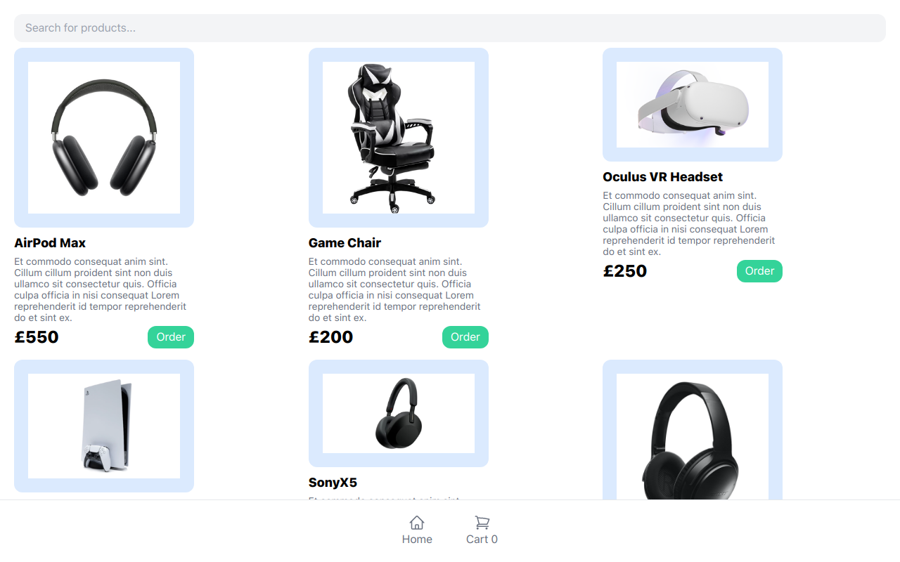

# Ecommerce Website Landing Page



This is a personal project for an e-commerce website built with Next.js, Tailwind CSS, MongoDB, and integrated with the Stripe API. The project aims to provide a user-friendly and secure online shopping experience.

## Table of Contents

- [Demo](#demo)
- [Features](#features)
- [Installation](#installation)
- [Usage](#usage)

## Demo

You can view a live demo of the website [here](https://ecomm-rho-rosy.vercel.app/).

## Features

- Responsive design for optimal viewing on different devices
- Product catalog showcasing various items avaliable for purchase
- Shopping cart functionality to add and manage selected products
- Secure payment processing using the Stripe API
- Integration with MongoDB to store and retrieve product data

## Installation

To run this project locally, follow these steps:

1. Clone the repository:

   ```bash
   git clone https://github.com/Timz-creator/Ecomm
   ```

## Usage

To use this e-commerce site, start by browsing throug the website to explore the wide range of products of services offered. The intuitive search functionality allows you to easily find specific products based on your preferences. Once you've find your desired items, you can add them to your shopping cart.

You can then checkout securely and be assured your payment details are handled safely and securely through a integration with the Stripe API.

Feel free to customize and adapt this e-commerce site to your specific needs or even extending the functionality.
